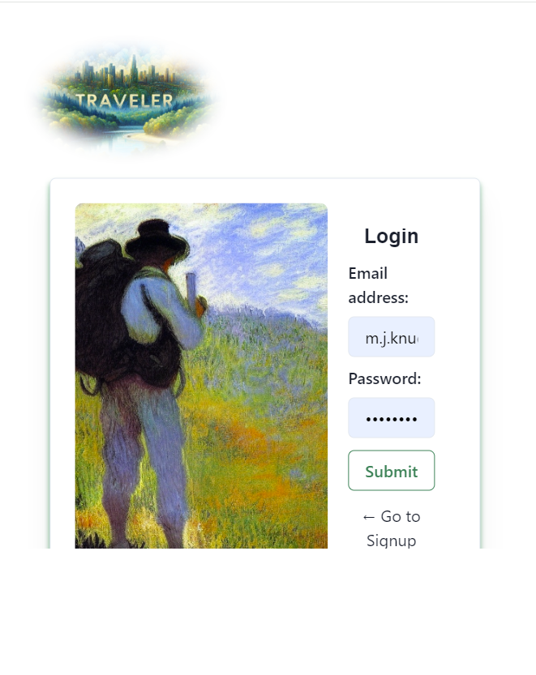

# Travel Log Application

## Description

This is a collaborative MERN-stack single-page application designed to allow users to create a list of places they would like to go when traveling. Users can create trips, create lists of waypoints, and then add comments to the lists as well as the individual waypoints. Users will log in to access their lists.  User authentication is implemented with JWT.

## Usage

View our website at : https://travel-log-j7hv.onrender.com/location

A screenshot of our app:  
## Credits

Collaborators: 
Matthew Knudson: https://github.com/Shagomir 
Megan Rogers: https://github.com/megankr 
Ellysa Schottler: https://github.com/ellysaschottler

## License
N/A
